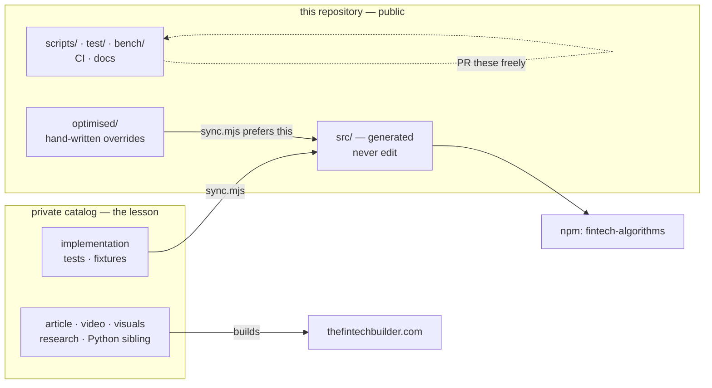
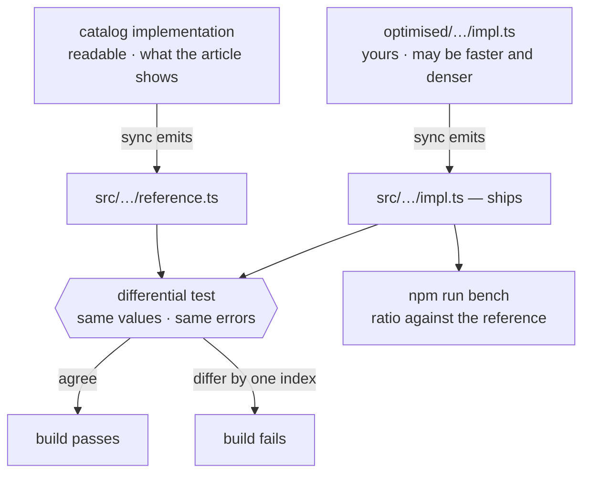

# Contributing

Thanks for looking. This repository works differently from most, so please read
the first section before opening a pull request — it will save you wasted work.

## How changes flow

**Everything under `src/` is generated, including `src/_shared/`. Do not edit
it.** [`scripts/sync.mjs`](scripts/sync.mjs) deletes both `src/` and
`test/fixtures/` before it writes, so a pull request that edits either is erased
on the next sync even when it is correct.

The source of truth is a private catalog. It holds each topic's article,
implementation, Python sibling, tests and fixtures — a topic here is a *lesson*,
not just a function, and the lesson is the part that stays private.

The code is not private. Every algorithm this package ships sits in
`src/**/impl.ts`, byte for byte the catalog file it came from, MIT licensed, and
included in the npm tarball. So there is no information barrier between you and
the implementations — only a question of which file a change lands in.



### The four ways in

|   | You have | Where it goes | Survives a sync |
|---|---|---|---|
| 1 | A tooling, test, CI or documentation change | **Pull request** | Yes — these files are not generated |
| 2 | A wrong number, with the input that produces it | **Issue** | It becomes a fixture |
| 3 | The same result, computed faster | **Pull request to `optimised/`** | Yes — see below |
| 4 | An algorithm the library does not have | **[Proposal issue](.github/ISSUE_TEMPLATE/new-algorithm.yml)**, then a pull request | Yes |

Lanes 1 and 2 have always worked. Lanes 3 and 4 are new, and both exist so that
a contribution can land in *this* repository rather than being transcribed by
hand into one you cannot see.

### Lane 2 — a wrong number is the most valuable thing you can send

Name the topic, the input, and the value you expect, with a source for the
expected value. It becomes a fixture, and a fixture moves a topic from
`contract` (signature and shape are checked) to `verified` (the arithmetic is
replayed and asserted on every build). That ratio is the number this library
lives on.

### Lane 3 — making something faster, in `optimised/`

The catalog implementation is written to be *read*: it is what the article
teaches. A production implementation may reasonably want preallocation, a
different loop, or a reused buffer. Those are different jobs, so they are allowed
to be different code — as long as they are the same behaviour.

Put an override at the same subpath the topic publishes:

```
optimised/technical-indicators/trend-smoothing/sma/impl.ts
```

On the next sync, that file ships instead of the catalog's, and the catalog
version is emitted beside it as `reference.ts`. You only replace the function you
are making faster — `export * from "./reference.ts"` inherits everything else, so
an override stays the size of the change rather than the size of the module.
There is a worked example at that exact path; copy its shape.

Then the two are held to each other:



Two things are checked, and neither is a matter of opinion:

- **`npm test`** replays both against the recorded example arguments and against
  prefixes of every array argument — where warm-up boundaries and reused buffers
  diverge first. Return values must be deeply equal, and a thrown error must have
  the same class and the same message.
- **`npm run bench`** prints the ratio against the reference. An override is a
  second implementation to maintain forever; under roughly 1.2x it rarely pays
  for itself.

Record the number with `npm run bench -- --save`, which writes
[`bench/results.json`](bench/results.json), and commit it with the override. CI
then runs `npm run bench -- --check` on every push and fails if a recorded ratio
has lost more than a quarter of its advantage — either the optimisation stopped
working or the reference caught up, and both are worth knowing.

Only ratios are stored. Absolute throughput describes the machine that produced
it, so quoting it anywhere else is meaningless. The ratio survives a noisy shared
runner because both implementations are measured alternately in the same process,
five short rounds with the median taken — measuring one fully and then the other
gave the same code anything from 2.7x to 5.0x, because whichever ran second met a
different JIT state.

An override may not import a `node:` builtin and may not change the entry point.
Both are refused by the generator with the reason named.

### Lane 4 — proposing a new algorithm

Open a [proposal issue](.github/ISSUE_TEMPLATE/new-algorithm.yml) first. One
step needs the maintainer: assigning the topic an id and a place in the taxonomy,
because those drive the subpath, the documentation URL and the prerequisite
order. It takes minutes and happens before you write anything.

After that it is a normal pull request — implementation, tests, fixtures — and it
can ship to npm **before the article exists**. The package and the website are
two products built from one catalog; only the website waits on the writing.

**You do not need to write the article.**

## Local development

Node ≥ 22.12 is required. The tests run TypeScript directly via
`--experimental-strip-types`, so there is no build step in the inner loop, and
the floor is 22.12 rather than 22 because the package's `require` condition
resolves to the same ES module — `require(esm)` is only unflagged from 22.12.

```bash
npm install
npm test
```

TypeScript ≥ 5.7 is needed only for `npm run build`;
`rewriteRelativeImportExtensions` is what turns the `.ts` import specifiers into
`.js` on emit.

| Command | What it does |
|---|---|
| `npm test` | Conformance, module contract, structural invariants, and the differential check on any override |
| `npm run build` | `tsc` → `dist/` |
| `npm run verify` | Build then test |
| `npm run coverage` | The suite with Node's built-in coverage reporter |
| `npm run bench` | Measure every override against its reference; `--all` measures the library |
| `npm run sync` | Regenerate `src/`, fixtures and the README from the catalog |
| `npm pack` | Build and produce a consumable tarball |

Only `npm run sync` needs the catalog. Everything else — tests, coverage,
benchmarks, the build — runs from a plain clone, because `src/`, the fixtures and
the manifest are all committed. **The package verifies itself without the
catalog**, which is what makes lanes 1, 3 and 4 possible at all.

`npm run sync` requires a local catalog checkout. It resolves it at
`<content-root>/algorithms/domains/**`, defaulting to two directories above the
repository; override with `--content-root <path>` or `FINTECH_CONTENT_ROOT`.

## What the tests actually prove

Four layers, deliberately different in strength. Read this before trusting a
green run.

**Layer 1 — conformance.** Every topic that ships a machine-readable worked
example is replayed and its output asserted against the numbers the catalog
published. This is the strongest guarantee here, and it covers the topics marked
`verified` rather than `contract` — the split is printed by `npm run sync` and
stated per topic in `docs.json`.

`expected` is asserted as a *subset* of the result; some fixtures document only
the fields the article discusses, not the whole payload. So `verified` means the
asserted fields are right, not that every field is.

**Layer 2 — module contract.** For every shipped topic: the module loads, `run()` is
callable and is genuinely an alias of the declared entry function, every function
the registry advertises exists, and the module's own `meta` agrees with the
registry. This is the safety net on the *generator* — if `sync.mjs` mis-detects
an entry point or drops an export, it fails here rather than in your project.

It is also a real bug catcher: entry detection once fell through to the first
exported function, silently giving every momentum topic `rsi()` and every volume
topic `obv()`. The `every entry point corresponds to its topic slug` test exists
because of that, and it is why new entry-point exceptions must be reviewed
individually rather than waved through with a blanket rule.

**Layer 3 — structural invariants.** No duplicate ids or subpaths; every topic
has a `package.json` exports entry; every subpath matches its article URL; lookup
helpers behave; `load()` rejects unknown ids.

**Layer 4 — differential, for overrides only.** Where a topic ships an
implementation from `optimised/`, the catalog version is emitted beside it and
both are run against the recorded example arguments and against prefixes of every
array argument. Values must be deeply equal; a thrown error must match in class
and message. This is what makes an optimisation reviewable by a machine rather
than by reading it closely — it catches a one-index shift in a warm-up boundary,
which is the most common way a faster rewrite goes wrong.

When no topic ships an override this layer skips, and that is the normal state.

## Generated blocks in the README

The statistics, shapes, coverage and full algorithm tables are generated by
[`scripts/update-readme.mjs`](scripts/update-readme.mjs) between HTML comment
markers. Edit the generator, not the table — hand edits are overwritten. The
README once claimed 114 topics long after the catalog had passed 150, which is
why these are generated at all.

## Drift

CI verifies that this package is still in step with the catalog. Because drift is
caused by catalog edits, that check runs on the catalog side, where it needs no
credentials. If the package and the catalog disagree, the fix is `npm run sync` —
never a hand edit to `src/`.

## Releasing

**Releases are published by CI, never from a laptop.** Pushing a `v*` tag is the
only trigger. [`.github/workflows/release.yml`](.github/workflows/release.yml)
re-runs the full verification, installs the packed tarball into a clean consumer,
and publishes with a provenance attestation — a signed, verifiable link between
the tarball on npm and the commit that produced it.

### What deserves a release

A version number is permanent: npm never allows one to be reused. Six releases
that change nothing a consumer executes make the number meaningless, so the
first question is whether to release at all.

| Change | Action |
|---|---|
| `docs.json`, `README.md`, comments, catalog metadata | **No release.** Commit and push — the docs site builds from `main`, not from npm. |
| Fixture correction, packaging or typing fix, generator fix | `patch` |
| New topics, new export subpaths, a new shipped file | `minor` |
| Signature or behaviour change | `minor` while pre-1.0 |

Nothing under `src/` changed? Then almost certainly no release. Batch related
work and cut one version when it is finished, rather than one per commit.

```bash
npm run sync            # only if the catalog has moved
npm run examples        # only if implementations changed — takes a few minutes
npm run verify          # must be fully green locally first
npm version patch       # or minor — see the table above; commits and tags
git push origin main --follow-tags
```

The workflow refuses to publish if the tag and `package.json` disagree, so the
version on npm always resolves to a commit in this repository.

Publishing is permanent: `npm unpublish` is only allowed within 72 hours, and a
version number can never be reused even after unpublishing.
